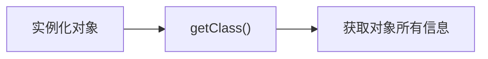
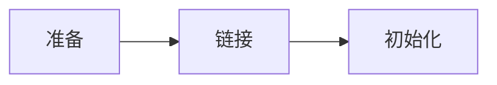
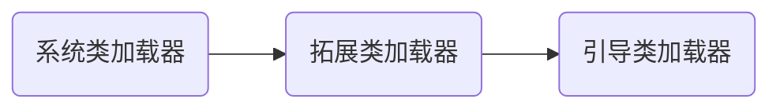

# Java注解


### Java注解和反射

[toc]

### 注解Annotation

- **Information for the compiler** — Annotations can be used by the compiler to detect errors or suppress warnings.
- **Compile-time and deployment-time processing** — Software tools can process annotation information to generate code, XML files, and so forth.
- **Runtime processing** — Some annotations are available to be examined at runtime.

##### 元注解：

- **@target**  描述使用对象
- **@retention** 描述作用范围
- @document 是否生成文档
- @inherited 是否允许继承注解

声明注解时，需要使用`@interface`定义。另外需要注意的是，**“接口”中的“方法”实际上是自定义注解的参数**，下面是一个自定义的注解代码

```java
public class Text {
    @MyAnnotation(name = "ymymguang", age = 22)
    public void text() {

    }
}

@Target({ElementType.METHOD, ElementType.TYPE})
@Retention(RetentionPolicy.RUNTIME)
@interface MyAnnotation {
    String name() ;
    int age() ;
}
```

可以直接在参数的后面添加default字段，指定默认值；

```java
@interface MyAnnotation {
    String name() default "xxx";
    int age() default 22;
}
```

当自定义注解仅存在一个属性时，不需要在使用注解时，使用了属性名称了；

```java
public class Text {
    @MyAnnotation("ymyguang")
    public void text() {

    }
}
@interface MyAnnotation {
    String name() default "xxx";
    int age() default 22;
}
```

---

### 反射Reflection

**有实例化的对象得到该对象的任何信息，例如属性，方法，接口等。反射是Java被视为动态语言的关键；**动态的编译和创建。何为反射？实际上反射就是：有对象得到的带对象的类；当然不一样的对象数据只要是被的同一个类实例化，所得到的结果都是同一个；



**前景知识：**

1. 一个类在内存中，只存在一个Class对象
2. 一个类被加载后，整个类的结构都被封装在Class对象当中

#### 获取Class类的几种方法

1. 实例化对象.getclass()

   ```java
   Class c2 = student.getClass();
   System.out.println(c2.hashCode());
   ```

2. Class.forname(“类名”)

   ```JAVA
   Class c3 = Class.forName("Person");
   System.out.println(c3.hashCode());
   ```

3. 类名.class;

   ```java
   Class c1 =  Person.class;
   System.out.println(c1.hashCode());
   ```

---

#### 类加载过程




1. **准备**：将.class文件载入到内存，静态数据转换成==方法区==运行时数据结构并且生成Java.long.Class对象（为反射提供了条件）
2. **链接**：将二进制代码载入到JVM当中，在此过程中会经历：验证，准备、解析三个阶段；
   - 验证：验证二进制代码是否符合JVM的规范，没有安全方面的问题
   - 准备：为类变量范围在`方法区`分配内存，并且为其初始化变量
   - 解析：将符号引用转换成直接引用；
3. **初始化**：执<clinit>()方法。类构造器方法<clinit>方法是由编译器时期所有的类变量复制动作和静态代码块中的语句组成的。

---

#### 主动引用和被动引用

相关样例模板代码：

```java
class Son extends Father{
    static {
        System.out.println("Son类被加载");
    }

    static int G = 2222;

    public static void show() {
        System.out.println("Son方法show()");
    }

    public void noStatic() {
        System.out.println("Son非静态的方法");
    }
}

class Father {
    static {
        System.out.println("Father类被加载");
    }
    static int M = 2;
}
```

##### 主动引用：主动引用的类会被初始化

主动引用的一些情况

- 虚拟机创建Main

- new 对象

- reflection反射

  ```Java
  public class Text03 {
      public static void main(String[] args) throws ClassNotFoundException {
          Class.forName("Son");
      }
  }
  ```

  ```Java
  //运行结果
  Father类被加载
  Son类被加载
  ```

  

- 调用类的静态成员和静态方法

  ```java
  public class Text03 {
      public static void main(String[] args) {
          System.out.println(Son.G);
          Son.show();
      }
  }
  ```

  ```
  输出结果：
  Son类被加载
  Son方法show()
  ```

##### 被动引用：被动引用的类不会被初始化

- 子类引用父类的静态变量或静态方法均不会初始化**当前子类对象**

  ```Java
  /**
   * @another ymyguang
   * @date 7/21/2021 9:39 AM
   */
  public class Text03 {
      public static void main(String[] args) throws ClassNotFoundException {
          System.out.println(Son.M);
      }
  }
  ```

  ```
  运行结果：
  Father类被加载
  2
  ```

- 定义数组引用

  ```Java
  /**
   * @another ymyguang
   * @date 7/21/2021 9:39 AM
   */
  public class Text03 {
      public static void main(String[] args) throws ClassNotFoundException {
  //        System.out.println(Son.M);
          Son son[] = new Son[10];
      }
  }
  ```

  ```
  运行结果：
  （空白）
  ```

  

- 引用常量也不会初始化当前类，常量在链接阶段就被加载到方法区了

  ```Java
  /**
   * @another ymyguang
   * @date 7/21/2021 9:39 AM
   */
  public class Text03 {
      public static void main(String[] args) throws ClassNotFoundException {
          System.out.println(Son.GG);
      }
  }
  ```

  ```
  运行结果：
  2
  ```

  

---

#### 类加载器



以下是各个加载器的说明，和加载顺序


#### 使用反射获取对象信息

如下所示，

```java
import java.lang.reflect.Field;
import java.lang.reflect.Method;

/**
 * @another ymyguang
 * @date 7/21/2021 11:06 AM
 */
public class Text05 {
    public static void main(String[] args) throws ClassNotFoundException {
        Class c1 = Class.forName("User");

        System.out.println(c1.getName());
        System.out.println(c1.getSimpleName());

        System.out.println("==================================");
        Field[] fields = c1.getFields();
        for (Field field : fields) {
            System.out.println(field);
        }
        System.out.println("==================================");
        fields = c1.getDeclaredFields();
        for (Field field : fields) {
            System.out.println(field);
        }
        System.out.println("==================================");
        // 所有的public类 ,包含继承
        Method[] methods = c1.getMethods();
        for (Method method : methods) {
            System.out.println(method);
        }
        System.out.println("==================================");
        //所有自己的方法，不包含继承
        methods = c1.getDeclaredMethods();
        for (Method method : methods) {
            System.out.println(method);
        }
    }
}
```

#### 使用反射的样例

首先要知道，反射的对象是这直接到类的，因此不管是获取方法还是获取属性。实际上都是从方法区获取的当前类的方法和属性，因此当要使用一个实例化对象的方法时，需要前提指定！

```Java
class User {
    private String name;
    private int age;

    public User() {
    }
    private void show() {
        System.out.println("COME FORE SHOW ");
    }
    @Override
    public String toString() {
        return "User{" +
                "name='" + name + '\'' +
                ", age=" + age +
                '}';
    }
    public User(String name, int age) {
        this.name = name;
        this.age = age;
    }
    public String getName() {
        return name;
    }
    public void setName(String name) {
        this.name = name;
    }
    public int getAge() {
        return age;
    }
    public void setAge(int age) {
        this.age = age;
    }
}
```

##### 使用反射修改函数属性内容

**set**方法

```java
import java.lang.reflect.Field;
import java.lang.reflect.InvocationTargetException;

/**
 * @another ymyguang
 * @date 7/21/2021 1:45 PM
 */
public class Text06 {
    public static void main(String[] args) throws ClassNotFoundException, IllegalAccessException, InstantiationException, NoSuchMethodException, InvocationTargetException, NoSuchFieldException {
        Class c1 = Class.forName("User");
//        通过反射信息实例化对象
        User user = (User)c1.getDeclaredConstructor().newInstance();
//      获取类的“name”属性字段的“地址”
        Field name = c1.getDeclaredField("name");
//       由于在User中，name属性是private,因此需要关闭安全检查后，才可以通过反射访问当前属性值
        name.setAccessible(true);
//       设置user中属性为name的值。注意：设置内容的原始格式是；name.set(Object, String);
        name.set(user, "ymyguang");
//       打印User的属性内容
        System.out.println(user.getName());
    }
}

```

##### 使用反射调用对象的方法

这里实际和上方的代码很相似， 都是先获取类的相关地址，之后指定执行对象；                                    <br>	**invoke**方法

```java
import java.lang.reflect.Field;
import java.lang.reflect.InvocationTargetException;
import java.lang.reflect.Method;

/**
 * @another ymyguang
 * @date 7/21/2021 1:45 PM
 */
public class Text06 {
    public static void main(String[] args) throws ClassNotFoundException, IllegalAccessException, InstantiationException, NoSuchMethodException, InvocationTargetException, NoSuchFieldException {
//		 获取类的元数据信息
        Class c1 = Class.forName("User");
//       通过反射，实例化类，实例化对象
        User user = (User)c1.getDeclaredConstructor().newInstance();
//      获取类的方法地址
        Method setName = c1.getDeclaredMethod("setName", String.class);
        
       
//       由于在User中，name属性是private,因此需要关闭安全检查后，才可以通过反射访问当前属性值
        setName.setAccessible(true);
//       设置user中属性为name的值。注意：设置内容的原始格式是；name.set(Object, 所需传参数值);
        setName.invoke(user, "ymyguang");
//       打印User的属性内容
        System.out.println(user.getName());
    }
}
```

##### 使用反射构造有参对象

```java
import java.lang.reflect.Constructor;
import java.lang.reflect.InvocationTargetException;

/**
 * @another ymyguang
 * @date 7/21/2021 2:21 PM
 */
public class Text07 {
    public static void main(String[] args) throws ClassNotFoundException, NoSuchMethodException, IllegalAccessException, InvocationTargetException, InstantiationException {
        Class c1 = Class.forName("User");
//        写法1
//        Constructor declaredConstructor = c1.getDeclaredConstructor(String.class, int.class);
//        User user = (User)declaredConstructor.newInstance("ymyguang",22);

//        写法2：获取到构造对象的信息后直接实例化；
        User user = (User)c1.getDeclaredConstructor(String.class, int.class).newInstance("ymyguang",22);
        System.out.println(user);
    }
}

// 运行结果
// User{name='ymyguang', age=22}
```

##### 反射获取注解

样例代码

```java
// 定义演示类
@Table(temp = "DB_table", name = "Student")
public class Student1 {
    @Field_An(columnName = "name", type = "varchar", length = 3)
    private String name;
    @Field_An(columnName = "age", type = "int", length = 10)
    private int age;
    @Field_An(columnName = "id", type = "int", length = 10)
    private int id;

    @Override
    public String toString() {
        return "Student{" +
                "name='" + name + '\'' +
                ", age=" + age +
                ", id=" + id +
                '}';
    }

    public String getName() {
        return name;
    }

    public void setName(String name) {
        this.name = name;
    }

    public int getAge() {
        return age;
    }

    public void setAge(int age) {
        this.age = age;
    }

    public int getId() {
        return id;
    }

    public void setId(int id) {
        this.id = id;
    }
}
// 定义注解
@Target(ElementType.TYPE)
@Retention(RetentionPolicy.RUNTIME)
@interface Table {
    String temp();

    String name();
}

@Target(ElementType.FIELD)
@Retention(RetentionPolicy.RUNTIME)
@interface Field_An {
    int length();

    String type();

    String columnName();
}
```


```java
import java.lang.annotation.*;
import java.lang.reflect.Field;

/**
 * @another ymyguang
 * @date 7/21/2021 3:11 PM
 */
public class Test08 {
    public static void main(String[] args) throws ClassNotFoundException, NoSuchFieldException {
        Class c1 = Class.forName("Student1");
//       获取类的注解
        Annotation[] annotations = c1.getAnnotations();
        for (Annotation annotation : annotations) {
            System.out.println(annotation);
        }

//       获取指定注解
        Table annotation = (Table) c1.getAnnotation(Table.class);
        System.out.println(annotation.name() + "  " + annotation.temp());

//       获取字段注解---获取当前类的字段
        Field id = c1.getDeclaredField("id");
//        获取当前字段的注解
        Field_An annotation_Field = id.getAnnotation(Field_An.class);
        System.out.print(annotation_Field.columnName());
        System.out.print(" " + annotation_Field.length());
        System.out.print(" " + annotation_Field.type());
    }
}


//输出结果
//@Table(temp="DB_table", name="Student")
//Student  DB_table
//id 10 int
```


